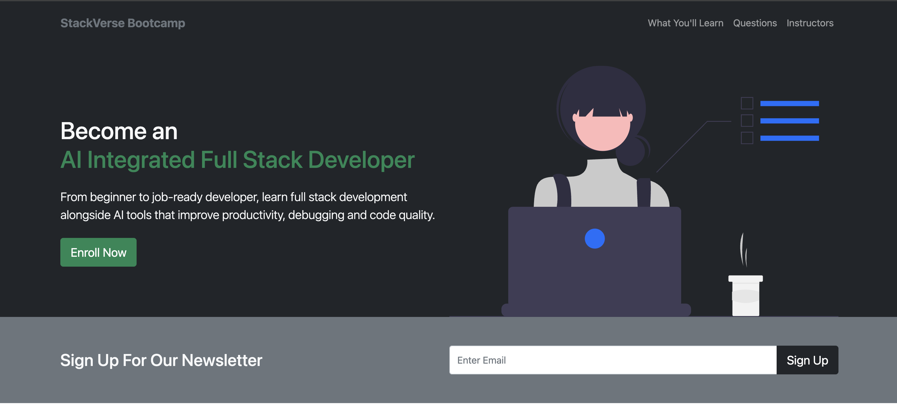
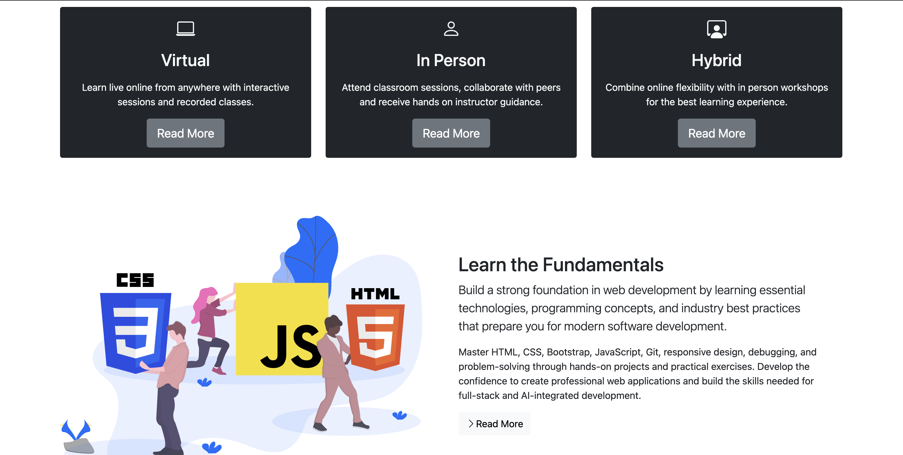
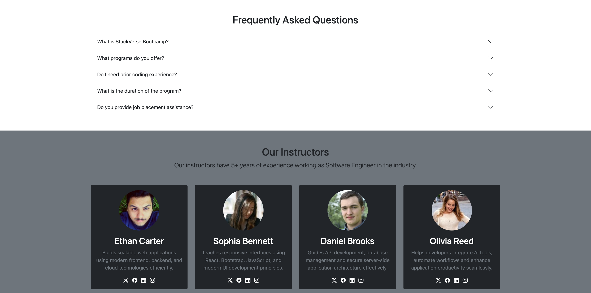
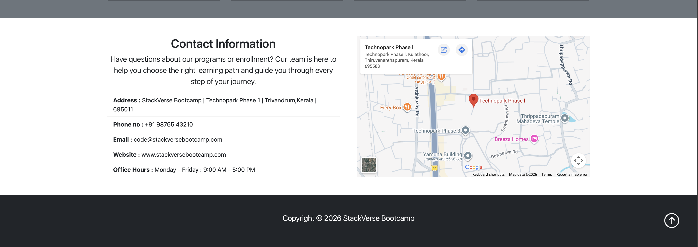

# 🧑‍💻 StackVerse Bootcamp

A responsive **coding bootcamp landing page** built using **HTML5, CSS3, Bootstrap 5 and Bootstrap Icons**. This project was created to practice building a real-world landing page with responsive layouts, Bootstrap components, structured sections and interactive UI elements.

## 📸 Preview

### 🏠 Home / Hero Section



### 📚 Learning Sections



### 👨‍🏫 Instructors & FAQ



### 📱 Contact & Footer



---

## 🚀 Live Demo

https://arjunsudheer-tech.github.io/stackverse-bootcamp/

---

## ✨ Features

* Responsive navigation bar with Bootstrap
* Hero section introducing the AI Integrated Full Stack Developer program
* Enroll Now button with Bootstrap modal
* Newsletter signup section
* Virtual, In Person and Hybrid learning options
* Fundamentals learning section
* React.js frameworks section
* Frequently Asked Questions section using Bootstrap accordion
* Instructor profile cards
* Contact information section
* Embedded Google Maps location
* Responsive layout using Bootstrap grid system
* Smooth scrolling navigation
* Responsive design for different screen sizes

---

## 🛠️ Built With

* HTML5
* CSS3
* Bootstrap 5

---

## 📂 Project Structure

```text
stackverse-bootcamp/
│
├── index.html
│
├── styles/
│   └── styles.css
│
├── images/
│   ├── showcase.svg
│   ├── fundamentals.svg
│   └── react.svg
│
├── icons/
│   └── logo.svg
│
└── README.md
```

---

## 🎯 What I Learned

While building this project, I practiced:

* Building a complete multi-section landing page
* Using Bootstrap's responsive grid system
* Creating responsive navigation with Bootstrap
* Working with Bootstrap cards
* Using Bootstrap modals
* Creating FAQ sections with Bootstrap accordion
* Using Bootstrap Icons
* Creating responsive layouts for different screen sizes
* Embedding Google Maps
* Organizing custom CSS separately from Bootstrap
* Using Flexbox and Bootstrap utility classes
* Working with spacing, typography and responsive utilities
* Structuring a real-world website into reusable sections

---

## 📱 Responsive Design

The website is designed to adapt to different screen sizes using **Bootstrap's responsive grid system and utility classes**.

The layout adjusts:

* Navigation menu
* Hero section
* Learning sections
* Learning option cards
* Instructor cards
* Contact section
* Spacing and typography

---

## 📈 Future Improvements

* Make the newsletter signup functional
* Add JavaScript form validation
* Connect the enrollment form to a backend
* Add actual functionality to the Read More buttons
* Add real social media links for instructors
* Add additional course/program pages
* Improve accessibility with better ARIA labels and descriptive `alt` text
* Add more interactive functionality

---

## 👨‍💻 Author

**Arjun S**

* GitHub: https://github.com/arjunsudheer-tech
* LinkedIn: https://www.linkedin.com/in/arjunsudheer-tech/

---

⭐ If you like this project, consider giving it a star.
